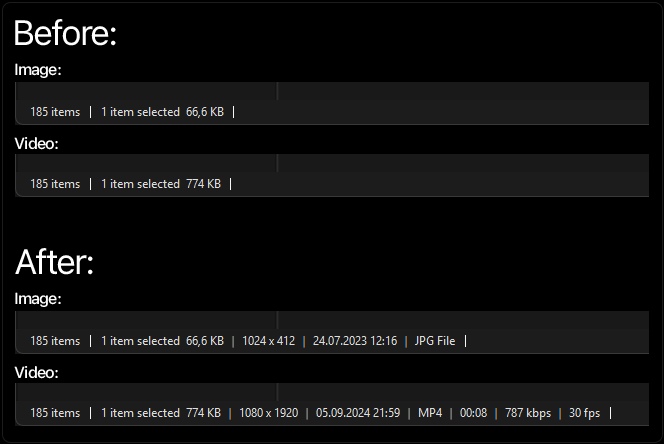

# Explorer Status Bar Metadata

A [Windhawk](https://windhawk.net/) mod for Windows Explorer that appends rich file metadata to the status bar when a single file is selected.[cite: 3]

[cite: 3]

## What it shows[cite: 3]

| Field | Example | Notes |
|---|---|---|
| Dimensions | `1920 x 1080` | Images and video[cite: 3] |
| Date modified | `15.05.2026 14:32` | System locale & timezone[cite: 3] |
| Duration | `01:24:35` | Video / audio[cite: 3] |
| Bitrate | `8.4 Mbps` | Video → audio → estimated[cite: 3] |
| Frame rate | `23.98 fps` | Video[cite: 3] |
| File type | `PNG Image` | Windows description (always aligned to the right edge) |

## Supported formats[cite: 3]

**Via Windows Property System** (indexed): JPEG, PNG, BMP, GIF, HEIC, MP4, MKV, AVI, MOV, MP3, FLAC, and most other common formats.[cite: 3]

**Via custom binary parser** (not indexed by Windows):[cite: 3]

| Format | Notes |
|---|---|
| SVG | viewBox priority, width/height fallback[cite: 3] |
| HDR | Radiance RGBE[cite: 3] |
| EXR | OpenEXR dataWindow[cite: 3] |
| TIFF / TX | Little-endian and big-endian[cite: 3] |
| TGA | Truevision TARGA (types 1–3, 9–11)[cite: 3] |
| PSD / PSB | Adobe Photoshop File (Dimensions extracted from fixed 26-byte header) |
| WebM / MKV | EBML/Matroska — dimensions + fps from DefaultDuration[cite: 3] |

## Design[cite: 3]

- **Zero polling.** Metadata is computed only when the selected file changes.[cite: 3]
- **Robust & Language-Independent.** Hooks `PSFormatForDisplayAlloc` (the exact property formatting function Explorer calls), eliminating text-matching heuristics and false positives.
- **Path-keyed cache** (up to 1000 entries). Same file = instant return, zero COM calls.[cite: 3]
- **True LRU eviction.** Cache hits dynamically move entries to the back of the queue, protecting frequently accessed files from being evicted.
- **Thread-safe.** Securely handles cross-thread messaging between shell worker threads and UI processes using strict Process ID guards.
- **Live Settings.** Changes made in the Windhawk UI (e.g., toggling network drives) clear the cache and apply instantly without requiring an Explorer restart.

## Settings[cite: 3]

Configurable in the Windhawk UI:[cite: 3]

| Setting | Default | Description |
|---|---|---|
| Enable metadata on network drives | Off | ⚠️ Can freeze Explorer on slow networks[cite: 3] |
| Enable metadata on removable drives | On | Disable for slow USB/SD media[cite: 3] |
| Cache eviction count | 10 | Entries removed when cache hits 1000[cite: 3] |

## Installation[cite: 3]

### Via Windhawk (recommended)[cite: 3]
Search for **"Explorer Status Bar Metadata"** in the Windhawk mod catalog and click Install.[cite: 3]

### Manual (load unpublished mod)[cite: 3]
1. Open Windhawk → click the **+** button → **Load unpublished mod**[cite: 3]
2. Paste the contents of the `.cpp` file.
3. Click **Compile & Apply**[cite: 3]

## Requirements[cite: 3]

- Windows 10 or 11[cite: 3]
- [Windhawk](https://windhawk.net/) v1.4 or later[cite: 3]

## License[cite: 3]

MIT © 2026 VitalS[cite: 3]
